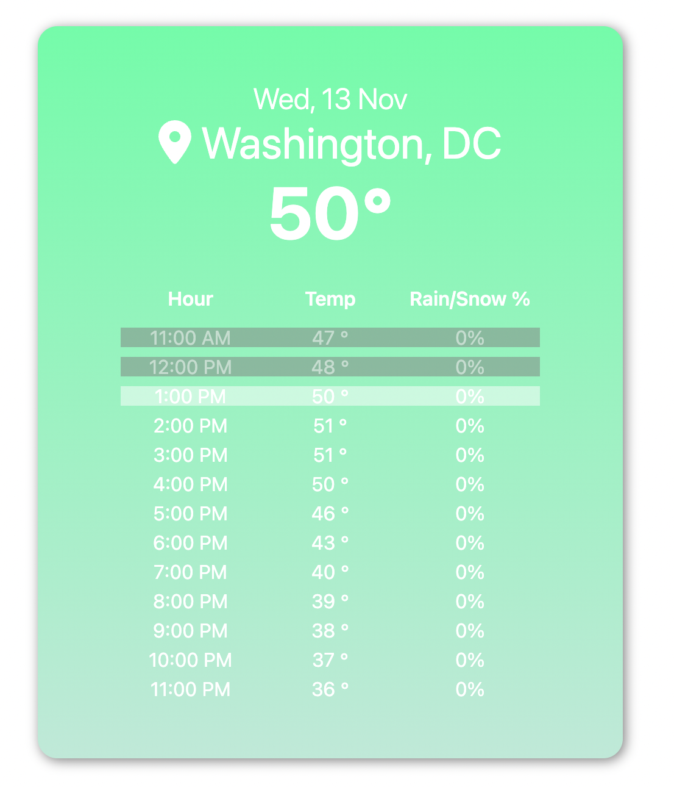

## Weather Today

Simple React app for checking the weather today currently and hourly. Uses OpenMeteo for weather data, and OpenCageData for location name. 

## Project Status
Basic version is complete. The user is able to give the application permission to grab the location coordinates (longitude and latitude), and the application grabs location name and weather data through 3rd party API's. Once the data is loaded, the user is then able to check the current weather as well as the hourly weather (temperature and precipitation percentage) during the day. 

Features considered to be added:
- Details about the weather using weather code (storms, etc)
- Ability to look at weather from the past (not sure how far back hourly data is provided from OpenMeteo)

Code Cleanup To-do:
- Create custom hooks for calling API

## Project Screen Shot(s)

## Installation and Setup Instructions

- `npm install`  
- `npm start`  
- Visit `localhost:3000` 

## Reflection

This was a side project to practice React and fetching data from API's. There was also a bit of brushing up on CSS involved. It was difficult at first to come up with the design because I wasn't completely sure what the shape of the data I was getting from OpenMeteo looked like. I took inspiration from the iPhone weather app, although it came out very different.
    
I also had to learn how to grab the user's location data as well as reverse geocoding. It was hard figuring out where (& when) I should be making the API calls. Through useEffect, I grabbed the user's location coordinates once the WeatherCard component mounted and then used that data to call the reverse geocoding API and OpenMeteo to fetch location name/weather data. All of the calls were done on WeatherCard component because I wanted all the data to show at once when they were ready.

I wanted the current hour's weather data to be readily viewable to the user when the application first rendered the data, so I made the HourlyCard scrollbox component scroll to the current hour - this was difficult to implement because I hadn't yet learned to store elements as Refs, especially when rendering a list of the same component from an array of data. I learned about forwardRef, a utility function that allows a parent component's ref to be assigned to a child - however, I also just learned that it will be deprecated going forward with functional components. Refs can now be passed to a child component by including ref when declaring a child component function (like one does with props).

I learned to create custom hooks for API calls after completing the basic version of this project, so that is something I would like to implement next. There were a couple cool data points from OpenMeteo I didn't utilize in the project that I think would make it more helpful for users, such as weather codes (provides detailed info on the weather like storms)